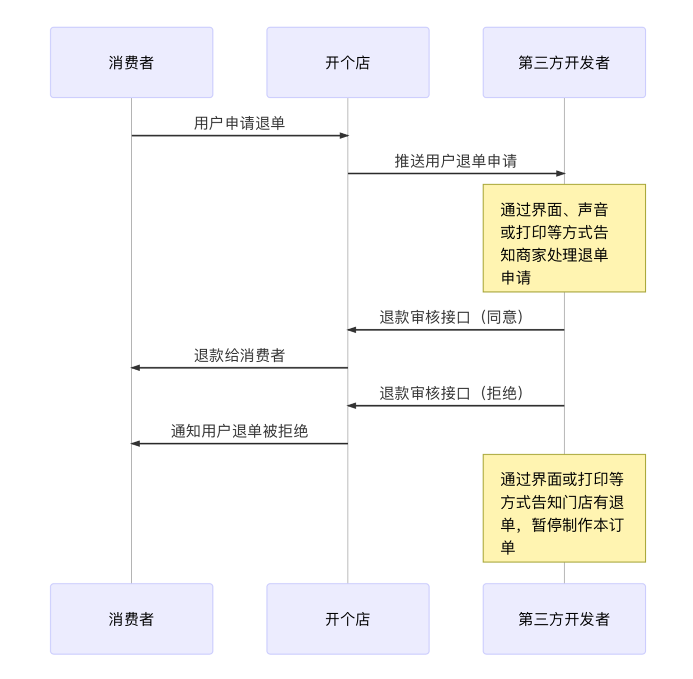
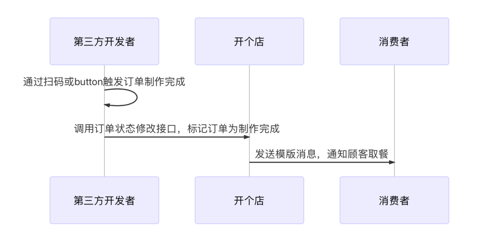

# 订单接单业务说明

## 订单接单

### 业务流程图

<!-- ```
sequenceDiagram
消费者->>开个店: 开个店小程序下单
开个店->>第三方开发者: 推送订单基本信息
第三方开发者->>开个店: 查询订单详情
第三方开发者->>开个店: 订单状态处理（接单/拒单）
开个店->>消费者: 微信模版消息（接单/拒单）
Note over 第三方开发者: 打印杯贴、小票、厨打等，门店制作餐品
``` -->


### 业务描述

1. 用户小程序下单支付成功后，非码推送新订单通知事件给第三方开发者。
2. 第三方开发者接到新订单通知事件，调用非码查询订单详情接口，获取订单信息。
3. 第三方开发者收到订单并确定接单后，调用非码订单状态处理接口，将订单状态变为“接单”。
4. 非码收到第三方开发者“接单”状态后，会将订单变为“已接单”状态，并页面告知用户。

## 商家接单前，用户申请取消订单

### 业务流程图

<!-- ```
sequenceDiagram

消费者->>开个店: 用户申请取消订单
开个店->>消费者: 退款给用户
开个店->>开个店: 修改订单状态为已取消
开个店->>第三方开发者: 推送订单取消通知
第三方开发者->>第三方开发者: 修改订单状态为已取消
Note over 第三方开发者: 通过界面或打印等方式告知门店订单已取消

``` -->


### 业务描述

1. 用户在商户接单前，可在小程序上申请取消订单，取消订单无需商家确认，直接退款。
2. 用户申请取消订单后，非码将推送订单状态变更通知，告知第三方开发者，用户申请取消订单。
3. 第三方开发者在收到取消订单推送后，如若没有拉取订单详情，可不再处理该订单。如果拉取过订单详情，则修改该订单状态为已取消，并告知门店不继续处理该订单。
4. 此处可考虑查看订单小票打印状态，如已打印过小票，则再打印一份取消小票告知店员。如未打印小票，则无需打印取消小票。


## 商家接单后，用户申请退单

### 业务流程图

<!-- ```
sequenceDiagram

消费者->>开个店: 用户申请退单
开个店->>第三方开发者: 推送用户退单申请
Note over 第三方开发者: 通过界面、声音或打印等方式告知商家处理退单申请
第三方开发者->>开个店: 退款审核接口（同意）
开个店->>消费者: 退款给消费者
第三方开发者->>开个店: 退款审核接口（拒绝）
开个店->>消费者: 通知用户退单被拒绝
Note over 第三方开发者: 通过界面或打印等方式告知门店有退单，暂停制作本订单
``` -->



### 业务描述

1. 商户接单后，如果用户要申请退单，需商户审核同意，才可退单。
2. 用户申请退单后，非码将推送订单状态变更通知，告知第三方开发者，用户申请退单。
3. 第三方开发者在收到退单申请后，可让店员进行人工处理，如同意或拒绝。
4. 店员处理后，第三方开发者调用非码商家退款处理接口，将处理结果告知非码，非码收到处理结果后，会以页面和消息方式，告知用户。
5. 如若商家同意退单，第三方开发者需处理该订单在其内部的后续状态流转。此处建议查看订单小票打印情况，如果该订单打印过小票，打一份退单小票告知店员。


## 堂食/自取订单制作完成回调

### 业务流程图

<!-- ```
sequenceDiagram

第三方开发者->>第三方开发者: 通过扫码或button触发订单制作完成
第三方开发者->>开个店: 调用订单状态修改接口，标记订单为制作完成
开个店->>消费者: 发送模版消息，通知顾客取餐
``` -->



### 业务描述

1. 如订单为堂食或自取类订单，门店在制作完成后，第三方开发者需回调非码订单状态处理接口，告知非码订单已经制作完成。
2. 非码在收到回调后，将页面和消息告知用户。
3. 此处流程建议在第三方开发者系统内，进行扫码操作，第一次扫订单码，视为订单制作完成。


## 堂食/自取订单完成回调

### 业务流程

<!-- ```
sequenceDiagram

第三方开发者->>第三方开发者: 通过扫码或button触发订单完成
第三方开发者->>开个店: 调用订单状态修改接口，标记订单为完成
开个店->>消费者: 发送模版消息，通知顾客做出消费评价
``` -->


### 业务描述

1. 如订单为堂食或自取类型，在顾客取走餐品后，第三方开发者需回调非码订单状态处理接口，告知订单已完成。
2. 非码在收到回调后，会将该订单标记为完成，并发放本次订单积分给用户。
3. 次流程建议在第三方开发者系统内，进行扫码操作，第二次扫订单码，视为订单完成。
